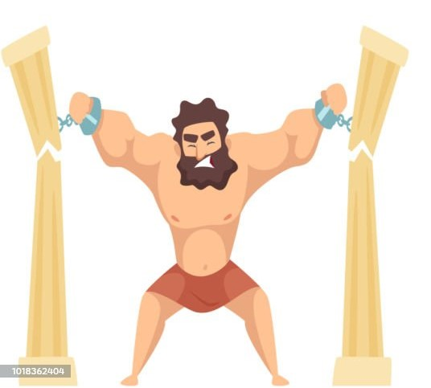
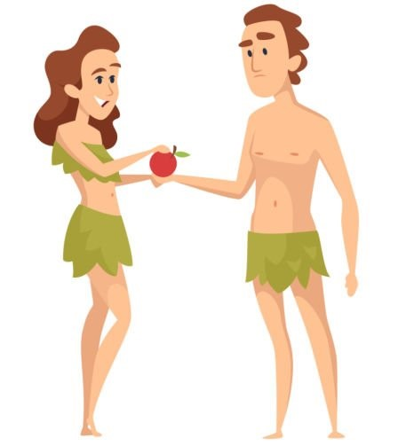

# Character Illustrator Prompt Templates

This repository contains prompt templates and style standards designed to customize a Character Illustrator LLM/Image Generator for creating flat vector biblical character illustrations.

| Sample 1 | Sample 2 | Sample 3 |
| :---: | :---: | :---: |
|  |  |  |

## File Overview

* **`flat_vector_biblical.md`**: Defines the visual style standards, body proportions (with subtle chibi influence), facial designs, color palettes, and framing constraints.
* **`instructions.txt`**: The system instructions to guide an image generation assistant to create illustrations strictly matching the defined style and using reference images.

## Setup Instructions

1.  **Upload Knowledge Base**: Download `flat_vector_biblical.md` and upload it to the knowledge/files section of your custom model:
    *   **Google Gemini**: "Knowledge"
    *   **ChatGPT**: "Project Sources"
    *   **Claude AI**: "Project Files"
2.  **Configure Instructions**: Copy the contents of `instructions.txt` and paste them into the **Instructions** or **System Prompt** text area of your custom image generator or assistant.
3.  **Provide Image References**: Ensure your assistant has access to the images in the `sample_images` directory to use as primary visual references for proportions and styling.

## Customization

You are encouraged to edit `flat_vector_biblical.md` and `instructions.txt` to adjust character proportions, introduce new props, or adapt the visual styling to other storytelling settings.
